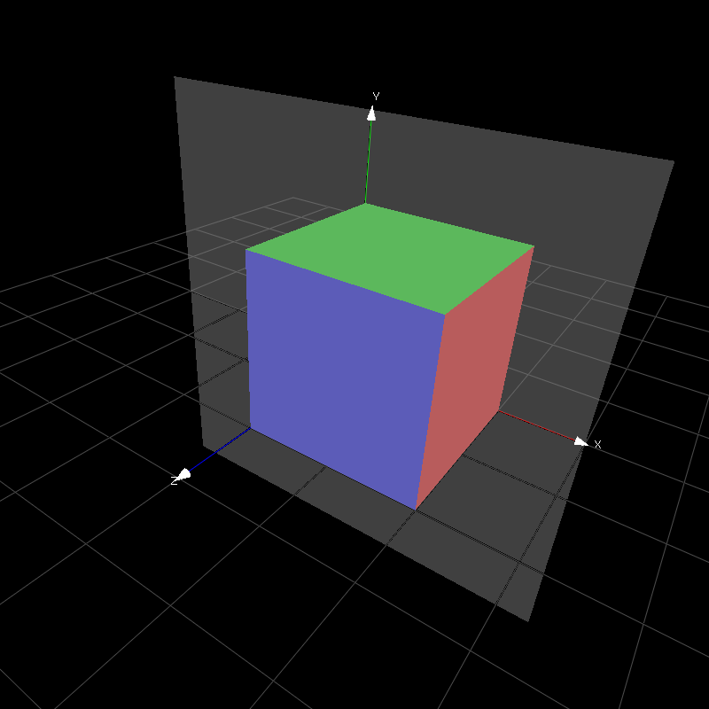

# MRHead

## usage

see [project wiki](https://github.com/imistyrain/MRHead/wiki)

## header files
- [mrdir.h](mrdir.h): provide cross platform EXISTS MKDIR SLEEP and getAllSubdirs, getAllFilesinDir .etc
- [mropencv.h](mropencv.h): provide cross verson opencv header files
- [mrlog.h](mrlog.h): provide elapse time
- [mrutil.h](mrutil.h): provide int/double to string convertion and split string

### gl
- [glcv.cpp](gl/glcv.cpp): capture camera to cv::Mat and draw it in OpenGL as texutre
- [solar.cpp](gl/solar.cpp): simulate solar systems
- [test.cpp](gl/test.cpp): switch between opengl1.* and 2.* shaders
- [gl3d.cpp](gl/gl3d.cpp): 3d obj viewer, use m key to switch different mode.
- [glutcube.cpp](gl/glutcube.cpp) : trackball rotation by mouse
- [glfwcube.cpp](gl/glfwcube.cpp) : supoort wheel and ctrl message, depend on [glm](https://github.com/g-truc/glm) >= 0.9.9

 